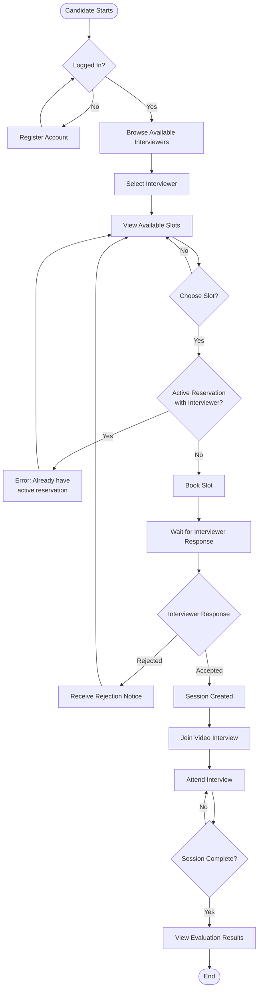
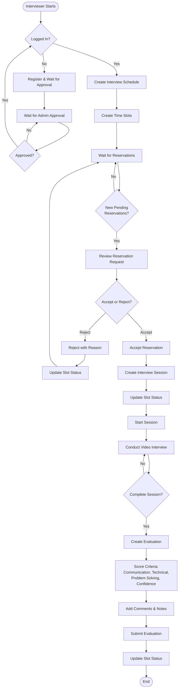
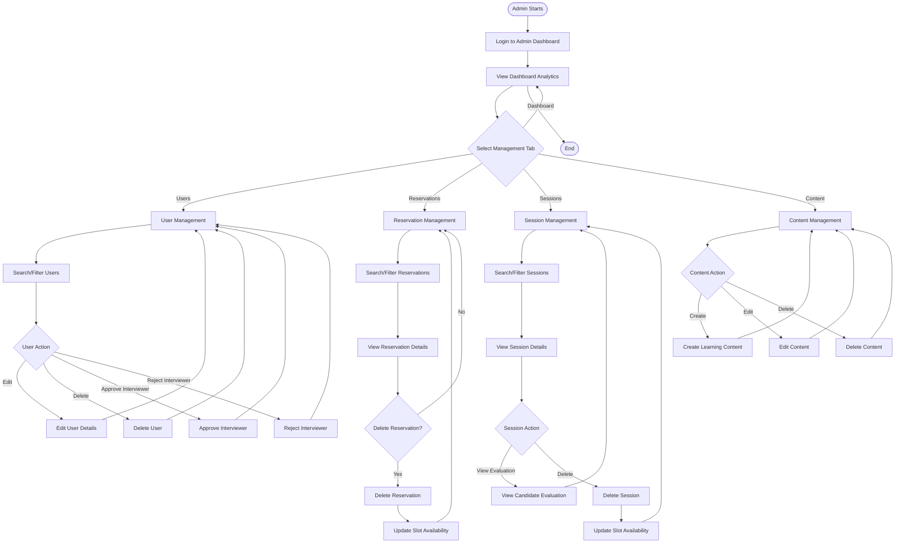
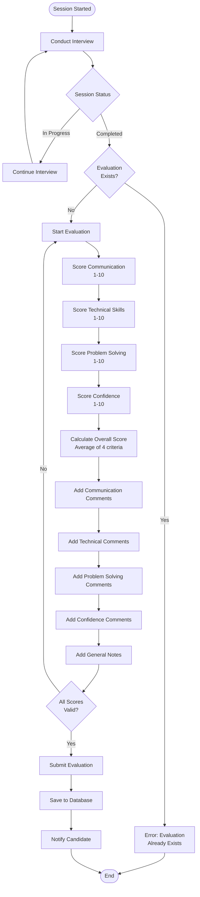
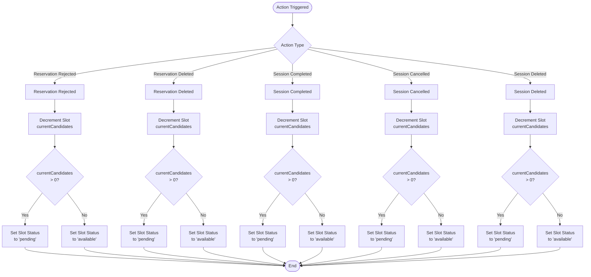

# Activity Diagrams - Taqyeem Platform

This document contains detailed activity diagrams for the main workflows in the Taqyeem Platform.

## 1. Candidate Booking and Interview Flow

This diagram shows the complete process from candidate registration through booking a slot, attending an interview, and viewing evaluation results.

**Key Steps:**

1. Candidate must be logged in to book slots
2. Can only have one active reservation per interviewer
3. Must wait for interviewer to accept/reject the reservation
4. If accepted, a session is created and candidate can join
5. After session completion, candidate can view evaluation results

---

## 2. Interviewer Schedule Management and Interview Flow

This diagram shows how interviewers create schedules, manage reservations, conduct interviews, and create evaluations.

**Key Steps:**

1. New interviewers must be approved by admin before they can create schedules
2. Interviewers create schedules and time slots
3. They review and accept/reject reservation requests
4. When accepted, a session is created
5. Interviewers conduct video interviews
6. After completion, they create evaluations with detailed scoring

---

## 3. Admin Management Flow

This diagram shows the various management operations available to administrators.

**Key Management Areas:**

1. **User Management**: Approve/reject interviewers, edit/delete users
2. **Reservation Management**: View, search, filter, and delete reservations
3. **Session Management**: View sessions, view evaluations, delete sessions
4. **Content Management**: Create, edit, and delete educational content
5. **Dashboard**: View platform analytics and statistics

---

## 4. Evaluation Process Flow

This diagram shows the detailed process of creating an evaluation after an interview session.

**Evaluation Criteria:**

1. **Communication** (1-10): Verbal communication skills, clarity, articulation
2. **Technical** (1-10): Technical knowledge and expertise
3. **Problem Solving** (1-10): Analytical thinking and problem-solving approach
4. **Confidence** (1-10): Self-assurance and presentation

**Overall Score**: Calculated as the average of all four criteria scores (rounded to nearest integer).

---

## 5. Slot Reversal Flow

This diagram shows how slot availability is restored when reservations or sessions are deleted, rejected, completed, or cancelled.

**Slot Status Logic:**

- **Available**: `currentCandidates = 0` (slot is completely free)
- **Pending**: `currentCandidates > 0` but `currentCandidates < maxCandidates` (has some bookings but not full)
- **Booked**: `currentCandidates >= maxCandidates` (slot is full)

**Reversal Triggers:**

- Reservation rejected by interviewer
- Reservation deleted by admin or candidate
- Session completed successfully
- Session cancelled
- Session deleted by admin

When any of these actions occur, the slot's `currentCandidates` count is decremented, and the status is updated accordingly to make the slot available again for new bookings.
