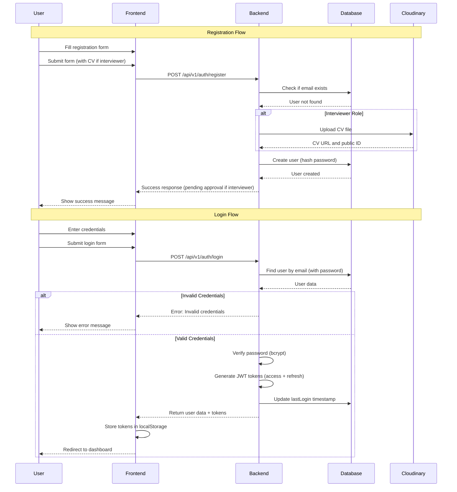
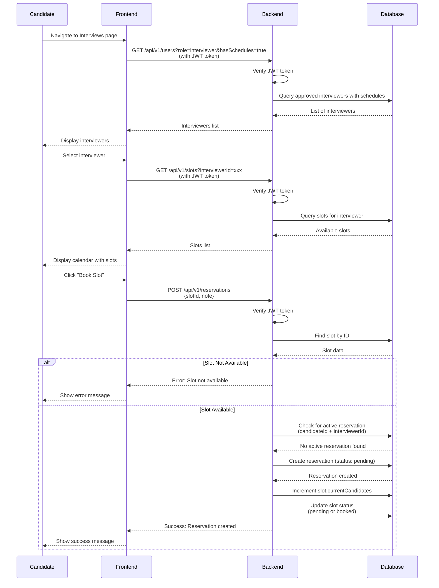
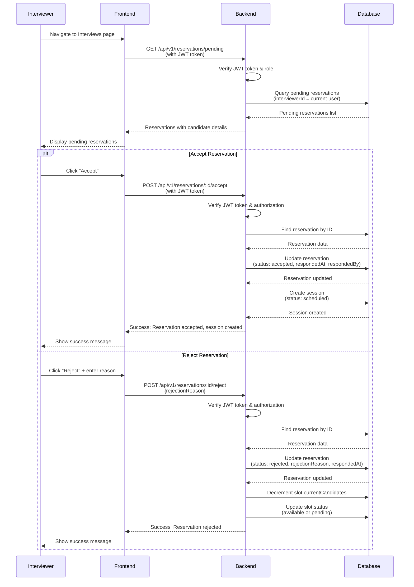
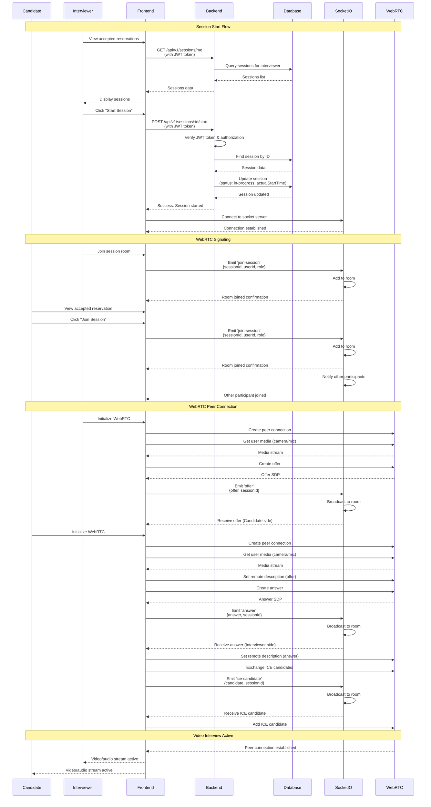
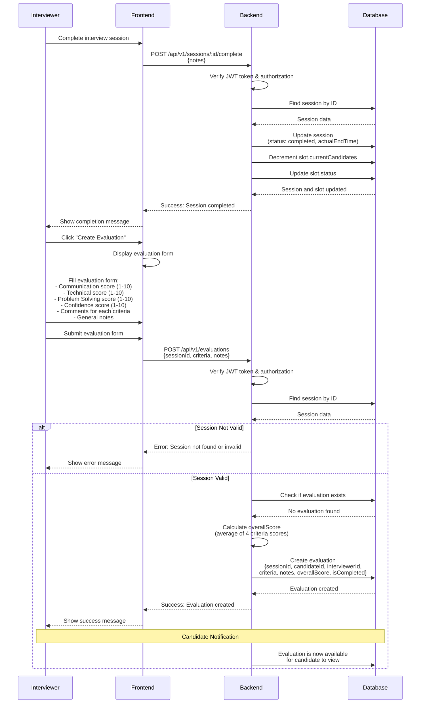
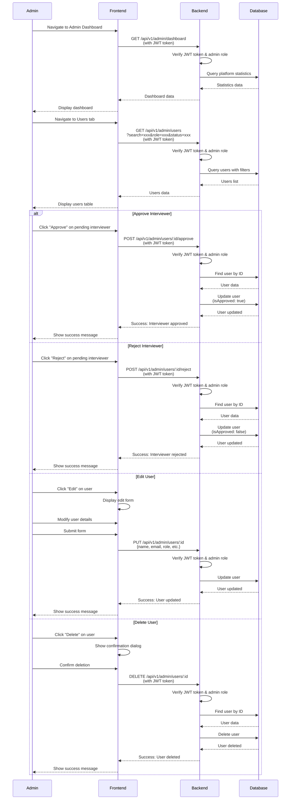
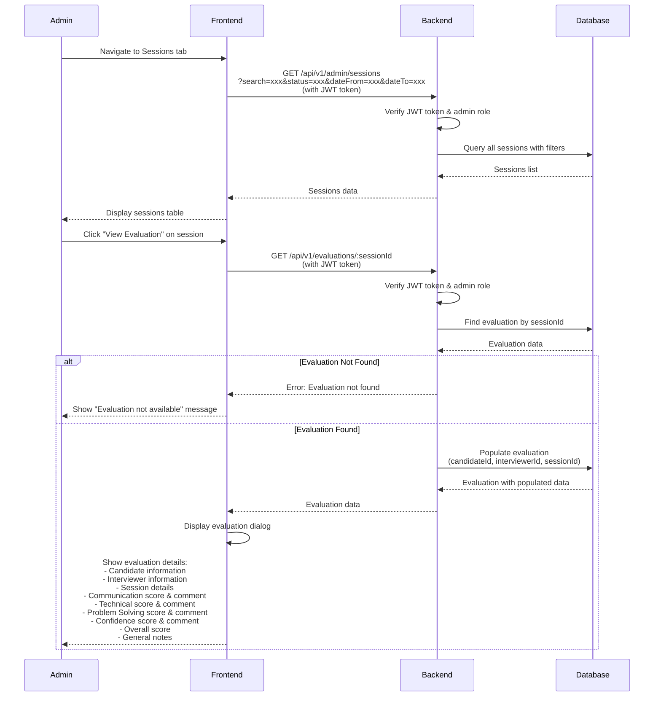
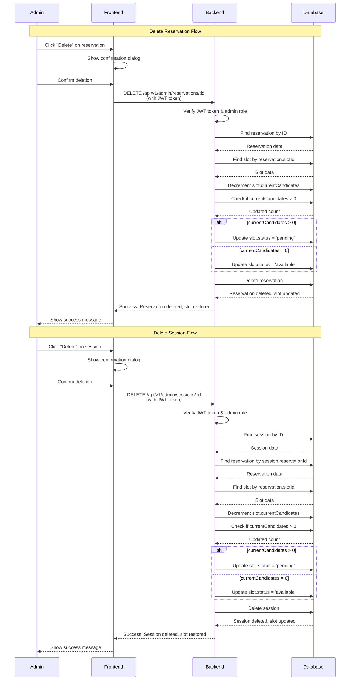

# Sequence Diagrams - Taqyeem Platform

This document contains sequence diagrams showing the detailed interactions between different components of the Taqyeem Platform over time.

## 1. User Registration and Login Sequence

This diagram shows the complete flow of user registration and authentication with JWT tokens.

---

## 2. Candidate Booking a Slot Sequence

This diagram shows how a candidate browses interviewers, views slots, and books an interview slot.

---

## 3. Interviewer Accepting/Rejecting Reservation Sequence

This diagram shows how an interviewer reviews and responds to reservation requests.

---

## 4. Starting Video Interview Session Sequence

This diagram shows the flow of starting a video interview session with WebRTC and Socket.io.

---

## 5. Creating Evaluation Sequence

This diagram shows how an interviewer creates an evaluation after completing an interview session.

---

## 6. Admin Managing Users Sequence

This diagram shows how an admin manages users, including approving interviewers and deleting users.

---

## 7. Admin Viewing Evaluation Sequence

This diagram shows how an admin views candidate evaluations from the sessions tab.

---

## 8. Slot Reversal Sequence (When Reservation/Session is Deleted)

This diagram shows how slot availability is restored when a reservation or session is deleted.

---

## Key Components in Sequences

### Frontend
- React application with React Query for data fetching
- JWT token stored in localStorage
- Socket.io client for real-time communication
- WebRTC API for video/audio streaming

### Backend
- Express.js REST API
- JWT authentication middleware
- Role-based authorization
- MongoDB with Mongoose ODM
- Socket.io server for signaling

### Database
- MongoDB collections: Users, Schedules, Slots, Reservations, Sessions, Evaluations
- Indexes for performance optimization
- Data relationships and population

### External Services
- Cloudinary: File storage (CVs, avatars, recordings)
- Socket.io: Real-time signaling for WebRTC
- WebRTC: Peer-to-peer video/audio communication

