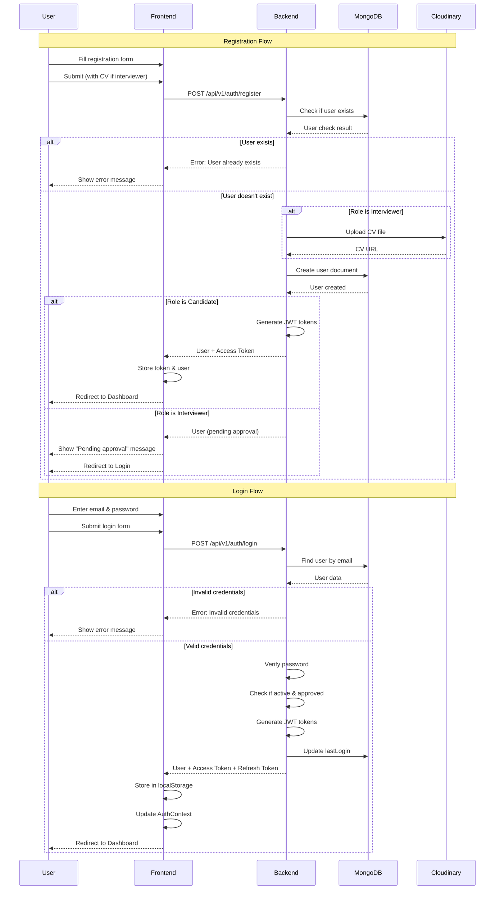
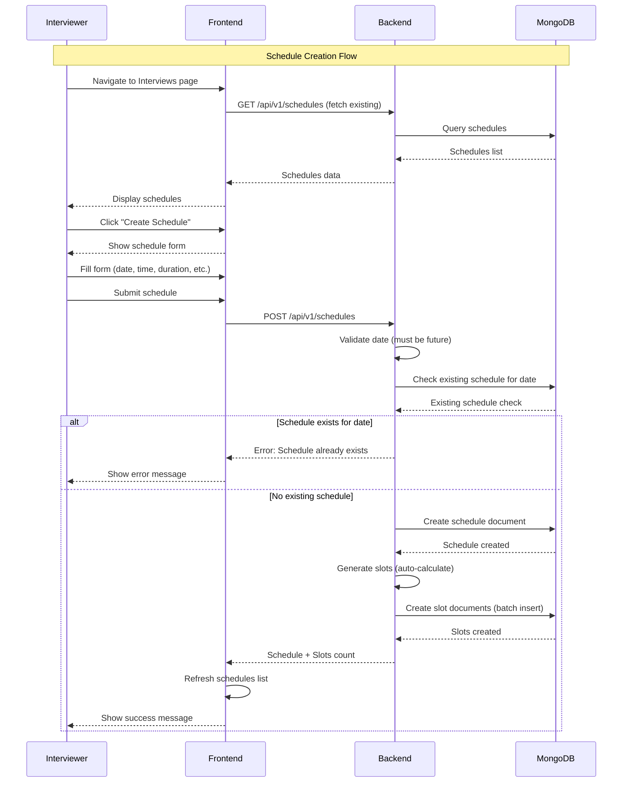
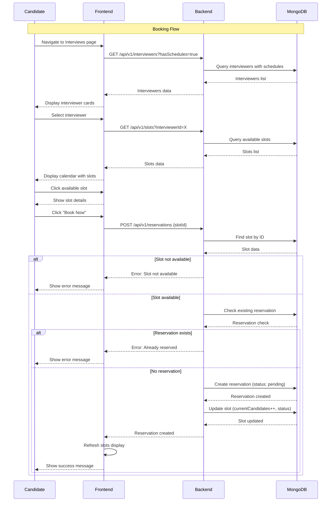
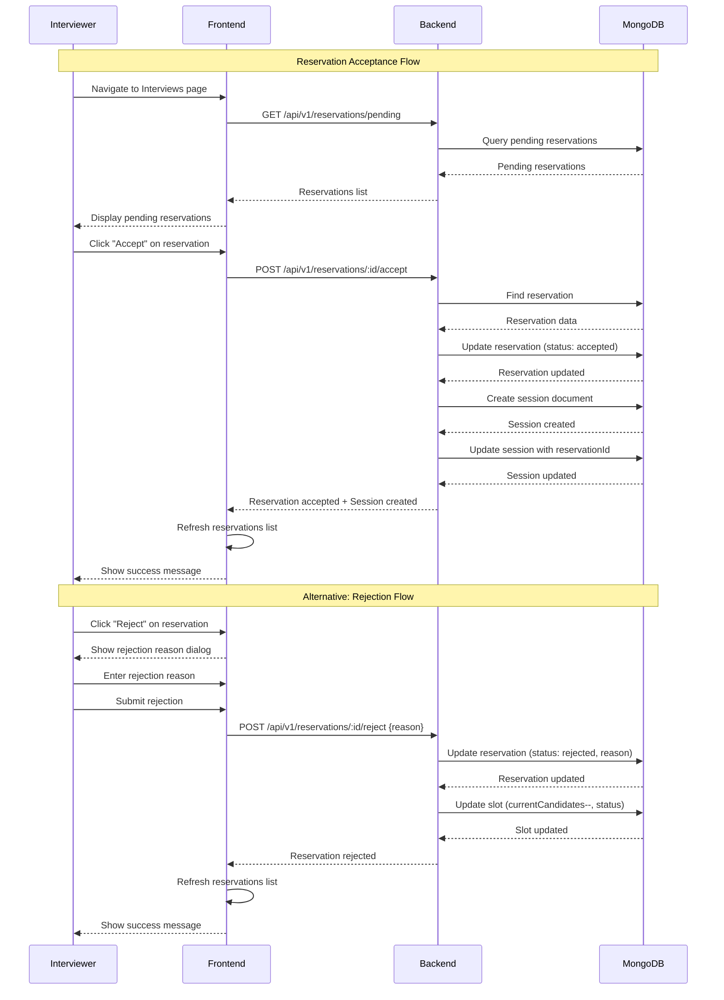
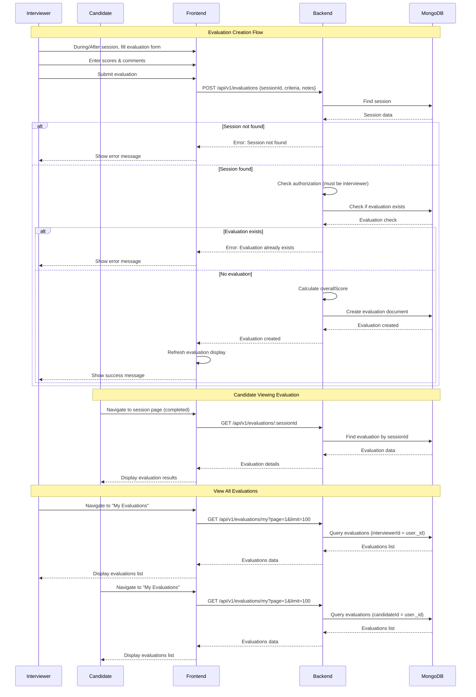

# Taqyeem Platform - Sequence Diagrams

This document contains sequence diagrams showing the main flows of the Taqyeem platform.

## 1. User Registration & Login Flow



## 2. Interviewer Schedule Creation Flow



## 3. Candidate Booking Flow



## 4. Reservation Acceptance Flow



## 5. Video Call Session Flow

```mermaid
sequenceDiagram
    participant Candidate
    participant Interviewer
    participant Frontend
    participant Backend
    participant SocketIO
    participant MongoDB

    Note over Candidate,MongoDB: Session Start Flow
    Interviewer->>Frontend: Navigate to session page
    Frontend->>Backend: GET /api/v1/sessions/:id
    Backend->>MongoDB: Find session
    MongoDB-->>Backend: Session data
    Backend-->>Frontend: Session details
    Frontend-->>Interviewer: Display session info
    
    Interviewer->>Frontend: Click "Start Session"
    Frontend->>Backend: POST /api/v1/sessions/:id/start
    Backend->>MongoDB: Update session (status: in-progress, meetingLink)
    MongoDB-->>Backend: Session updated
    Backend-->>Frontend: Session started
    Frontend->>Frontend: Initialize WebRTC
    
    Note over Candidate,SocketIO: WebRTC Connection Setup
    Interviewer->>Frontend: Request media (getUserMedia)
    Frontend->>Frontend: Get local stream
    Interviewer->>SocketIO: Connect to socket
    SocketIO-->>Interviewer: Socket connected
    Interviewer->>SocketIO: Join session room
    
    Candidate->>Frontend: Navigate to session page
    Frontend->>Backend: GET /api/v1/sessions/:id
    Backend->>MongoDB: Find session
    MongoDB-->>Backend: Session data
    Backend-->>Frontend: Session details
    Frontend-->>Candidate: Display session info
    
    Candidate->>Frontend: Click "Join Call"
    Frontend->>Frontend: Initialize WebRTC
    Candidate->>Frontend: Request media (getUserMedia)
    Frontend->>Frontend: Get local stream
    Candidate->>SocketIO: Connect to socket
    SocketIO-->>Candidate: Socket connected
    Candidate->>SocketIO: Join session room
    
    Note over Candidate,SocketIO: WebRTC Signaling
    Interviewer->>Frontend: Create RTCPeerConnection
    Interviewer->>Frontend: Create offer
    Interviewer->>SocketIO: Emit offer
    SocketIO->>Candidate: Receive offer
    Candidate->>Frontend: Set remote description
    Candidate->>Frontend: Create answer
    Candidate->>SocketIO: Emit answer
    SocketIO->>Interviewer: Receive answer
    Interviewer->>Frontend: Set remote description
    
    Interviewer->>Frontend: Gather ICE candidates
    Interviewer->>SocketIO: Emit ICE candidate
    SocketIO->>Candidate: Receive ICE candidate
    Candidate->>Frontend: Add ICE candidate
    
    Candidate->>Frontend: Gather ICE candidates
    Candidate->>SocketIO: Emit ICE candidate
    SocketIO->>Interviewer: Receive ICE candidate
    Interviewer->>Frontend: Add ICE candidate
    
    Note over Candidate,Interviewer: Video Call Active
    Candidate<->Interviewer: P2P video/audio stream
    
    Note over Candidate,MongoDB: Evaluation During Call
    Interviewer->>Frontend: Update evaluation scores
    Frontend->>SocketIO: Emit evaluation-update
    SocketIO->>Candidate: Broadcast evaluation-update
    Candidate->>Frontend: Update evaluation display
    
    Note over Candidate,MongoDB: Session Completion
    Interviewer->>Frontend: Click "End Call"
    Frontend->>Frontend: Close peer connection
    Interviewer->>SocketIO: Leave room
    Candidate->>SocketIO: Leave room
    
    Interviewer->>Frontend: Click "Complete Session"
    Frontend->>Backend: POST /api/v1/sessions/:id/complete
    Backend->>MongoDB: Update session (status: completed, actualEndTime)
    MongoDB-->>Backend: Session updated
    Backend-->>Frontend: Session completed
    Frontend-->>Interviewer: Show success message
```

## 6. Evaluation Flow



## 7. Complete Interview Lifecycle Flow

```mermaid
sequenceDiagram
    participant Candidate
    participant Interviewer
    participant Admin
    participant Frontend
    participant Backend
    participant MongoDB
    participant SocketIO

    Note over Candidate,SocketIO: Complete Interview Lifecycle
    
    rect rgb(200, 220, 255)
        Note over Interviewer,MongoDB: Phase 1: Setup
        Interviewer->>Frontend: Register (with CV)
        Frontend->>Backend: POST /api/v1/auth/register
        Backend->>MongoDB: Create user (isApproved: false)
        Admin->>Backend: Approve interviewer
        Backend->>MongoDB: Update user (isApproved: true)
        Interviewer->>Frontend: Create schedule
        Frontend->>Backend: POST /api/v1/schedules
        Backend->>MongoDB: Create schedule + auto-generate slots
    end
    
    rect rgb(220, 255, 220)
        Note over Candidate,MongoDB: Phase 2: Booking
        Candidate->>Frontend: Browse interviewers
        Frontend->>Backend: GET /api/v1/interviewers
        Candidate->>Frontend: Select interviewer & slot
        Frontend->>Backend: POST /api/v1/reservations
        Backend->>MongoDB: Create reservation (status: pending)
    end
    
    rect rgb(255, 255, 200)
        Note over Interviewer,MongoDB: Phase 3: Acceptance
        Interviewer->>Frontend: View pending reservations
        Frontend->>Backend: GET /api/v1/reservations/pending
        Interviewer->>Frontend: Accept reservation
        Frontend->>Backend: POST /api/v1/reservations/:id/accept
        Backend->>MongoDB: Update reservation + Create session
    end
    
    rect rgb(255, 220, 220)
        Note over Candidate,SocketIO: Phase 4: Video Call
        Interviewer->>Frontend: Start session
        Frontend->>Backend: POST /api/v1/sessions/:id/start
        Backend->>MongoDB: Update session (status: in-progress)
        Interviewer->>SocketIO: Connect & join room
        Candidate->>SocketIO: Connect & join room
        Candidate<->Interviewer: WebRTC P2P video call
        Interviewer->>Frontend: Complete session
        Frontend->>Backend: POST /api/v1/sessions/:id/complete
        Backend->>MongoDB: Update session (status: completed)
    end
    
    rect rgb(220, 220, 255)
        Note over Interviewer,MongoDB: Phase 5: Evaluation
        Interviewer->>Frontend: Create evaluation
        Frontend->>Backend: POST /api/v1/evaluations
        Backend->>MongoDB: Create evaluation
        Candidate->>Frontend: View evaluation
        Frontend->>Backend: GET /api/v1/evaluations/:sessionId
        Backend->>MongoDB: Find evaluation
        Backend-->>Frontend: Evaluation data
        Frontend-->>Candidate: Display evaluation results
    end
```

## Key Components

### Actors
- **Candidate**: User seeking interview practice
- **Interviewer**: User conducting interviews
- **Admin**: Platform administrator
- **Frontend**: React application
- **Backend**: Express.js API server
- **MongoDB**: Database
- **SocketIO**: WebSocket server for real-time communication
- **Cloudinary**: File storage service

### Main Entities
- **User**: Candidate, Interviewer, or Admin
- **Schedule**: Interviewer's availability schedule
- **Slot**: Time slot within a schedule
- **Reservation**: Candidate's booking request
- **Session**: Actual interview session
- **Evaluation**: Interviewer's assessment of candidate

### Key Flows
1. **Authentication**: Registration → Approval (for interviewers) → Login
2. **Scheduling**: Interviewer creates schedule → Slots auto-generated
3. **Booking**: Candidate browses → Selects slot → Creates reservation
4. **Acceptance**: Interviewer reviews → Accepts/Rejects → Session created
5. **Video Call**: Session starts → WebRTC connection → Real-time call
6. **Evaluation**: Interviewer evaluates → Candidate views results

