# Use Case Diagram - Taqyeem Platform

This diagram shows all actors and their interactions with the Taqyeem Platform system.

## Use Case Diagram

```mermaid
graph TB
    Candidate[👤 Candidate]
    Interviewer[👨‍💼 Interviewer]
    Admin[👑 Admin]
    System[Taqyeem Platform]

    Candidate -->|Register/Login| System
    Candidate -->|Browse Interview Slots| System
    Candidate -->|Book Interview Slot| System
    Candidate -->|View Reservations| System
    Candidate -->|Join Video Interview| System
    Candidate -->|View Evaluations| System
    Candidate -->|Access Learning Content| System
    Candidate -->|Manage Profile| System

    Interviewer -->|Register/Login| System
    Interviewer -->|Create Interview Schedule| System
    Interviewer -->|Create Time Slots| System
    Interviewer -->|View Pending Reservations| System
    Interviewer -->|Accept/Reject Reservations| System
    Interviewer -->|Start Interview Session| System
    Interviewer -->|Conduct Video Interview| System
    Interviewer -->|Complete Session| System
    Interviewer -->|Create Evaluation| System
    Interviewer -->|View Session History| System

    Admin -->|Login| System
    Admin -->|Manage Users| System
    Admin -->|Approve/Reject Interviewers| System
    Admin -->|View All Reservations| System
    Admin -->|Delete Reservations| System
    Admin -->|View All Sessions| System
    Admin -->|Delete Sessions| System
    Admin -->|View Evaluations| System
    Admin -->|Manage Learning Content| System
    Admin -->|View Platform Analytics| System
```

## Actors

### 👤 Candidate

- **Description**: Users seeking interview opportunities
- **Key Use Cases**:
  - Register and login to the platform
  - Browse available interview slots from different interviewers
  - Book interview slots (one per interviewer)
  - View their reservations and their status
  - Join scheduled video interview sessions
  - View evaluation results and feedback
  - Access educational learning content
  - Manage their profile and preferences

### 👨‍💼 Interviewer

- **Description**: Professionals who conduct interviews
- **Key Use Cases**:
  - Register and wait for admin approval
  - Create interview schedules with dates and times
  - Create time slots for interviews
  - View pending reservation requests
  - Accept or reject reservations with reasons
  - Start and conduct real-time video interview sessions
  - Complete or cancel sessions
  - Create comprehensive evaluations with criteria scoring
  - View session history and statistics

### 👑 Admin

- **Description**: Platform administrators with full system access
- **Key Use Cases**:
  - Login to admin dashboard
  - Manage all users (view, edit, delete)
  - Approve or reject interviewer registration requests
  - View all reservations with search and filtering
  - Delete reservations
  - View all sessions with search and filtering
  - Delete sessions
  - View candidate evaluations
  - Manage educational learning content (create, edit, delete)
  - View platform analytics and statistics

## System Boundaries

The **Taqyeem Platform** system includes:

- User authentication and authorization
- Interview scheduling and slot management
- Reservation management
- Real-time video interview sessions (WebRTC)
- Evaluation and feedback system
- Learning content management
- Analytics and reporting
